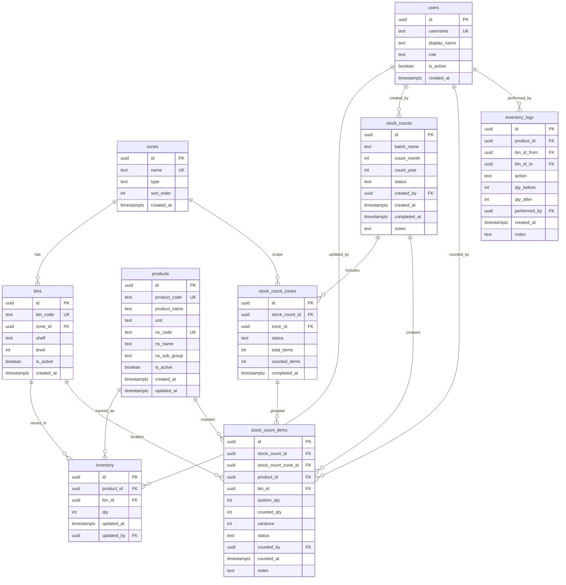
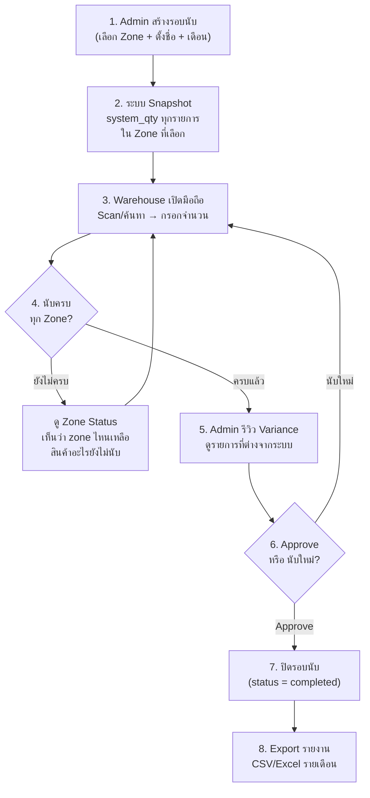
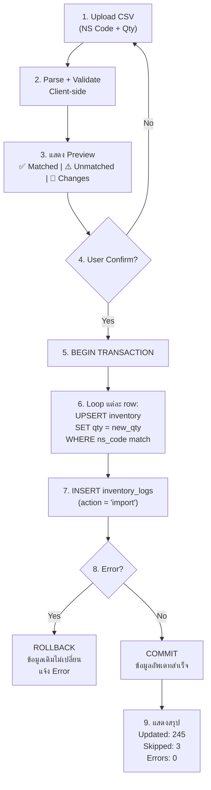
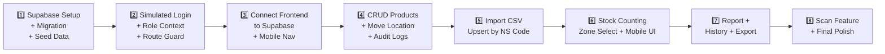

# DDS Warehouse Management System — Development Plan v3

> **วันที่:** 2026-02-13  
> **สถานะ:** 📋 Design & Review — Finalized Decisions

---

## ✅ สรุปการตัดสินใจ

| หัวข้อ | ตัดสินใจแล้ว |
|--------|------------|
| **Supabase Project** | สร้างใหม่ชื่อ `dds-bin-location` ผ่าน MCP |
| **User Roles** | Admin, Warehouse, Accounting (3 roles) |
| **Stock Count** | เลือก Zone ได้ + tracking สถานะ 100% + ประวัติรอบนับ + รายงานรายเดือน |
| **Import Strategy** | Upsert ใน Transaction (ปลอดภัย ข้อมูลไม่หาย) |

---

## 1. สรุปภาพรวมระบบปัจจุบัน (As-Is)

| หัวข้อ | รายละเอียด |
|--------|-----------|
| **Tech Stack** | React 18 + Vite + Tailwind CSS |
| **Data Storage** | localStorage (client-side only) |
| **Data Source** | CSV Import (~2,490 rows ใน `template_final.csv`) |
| **Authentication** | ไม่มี |
| **Features ที่มี** | Dashboard, Zone/Bin View, CSV Import, Global Search, QR Label Print |

### ⚠️ ปัญหาหลักที่ต้องแก้

1. **ไม่มี Database** — ข้อมูลอยู่ใน localStorage หายเมื่อ clear browser
2. **ไม่มี User/Auth** — ไม่รู้ว่าใครทำอะไร
3. **ไม่มี Stock Counting** — ไม่มีระบบนับ stock, ไม่มี audit trail
4. **ไม่มี CRUD สินค้า** — ไม่สามารถแก้ไข/ย้าย location ได้จากหน้าจอ
5. **ไม่ Mobile Friendly** — ออกแบบสำหรับ Desktop เป็นหลัก

---

## 2. Supabase Database Design

### 2.1 ER Diagram



### 2.2 รายละเอียดตาราง

#### `users` — ผู้ใช้งาน (3 Roles)

| Column | Type | Description |
|--------|------|-------------|
| id | uuid (PK) | |
| username | text (UNIQUE) | `admin`, `warehouse1`, `accounting1` |
| display_name | text | ชื่อแสดงผล |
| role | text | `admin` / `warehouse` / `accounting` |
| is_active | boolean | default true |

**สิทธิ์ตาม Role:**

| Feature | Admin | Warehouse | Accounting |
|---------|-------|-----------|------------|
| ดู Dashboard / Zone / Bin | ✅ | ✅ | ✅ |
| CRUD สินค้า + ย้าย Location | ✅ | ✅ | ❌ |
| สร้างรอบนับ Stock | ✅ | ❌ | ❌ |
| นับ Stock (กรอกจำนวน) | ✅ | ✅ | ❌ |
| ดูรายงาน Stock | ✅ | ✅ | ✅ |
| Export รายงาน | ✅ | ❌ | ✅ |
| Import ข้อมูล | ✅ | ❌ | ❌ |
| จัดการผู้ใช้ | ✅ | ❌ | ❌ |

> **Best Practice:** ใช้ simulated login (เลือก user จาก dropdown) — ลดความซับซ้อน แต่ยังรู้ "ใครทำอะไร"

#### `zones` — โซน/พื้นที่

| Column | Type | Description |
|--------|------|-------------|
| name | text (UNIQUE) | เช่น `A`, `B`, `Premium`, `Cutsize` |
| type | text | `standard` / `special` |
| sort_order | int | ลำดับแสดงผล |

#### `bins` — ช่อง/ถังเก็บ

| Column | Type | Description |
|--------|------|-------------|
| bin_code | text (UNIQUE) | เช่น `OB_Non A1-1`, `OB_Cutsize` |
| zone_id | uuid (FK) | |
| shelf | text | เช่น `A1`, `Bulk Storage` |
| level | int | ชั้น |

#### `products` — สินค้า (Master Data)

| Column | Type | Description |
|--------|------|-------------|
| product_code | text (UNIQUE) | รหัสสินค้าเดิม |
| ns_code | text (UNIQUE) | **Key หลักตอน import** |
| product_name | text | |
| ns_name / unit / ns_sub_group | text | ข้อมูลเสริม |

#### `inventory` — สต็อกปัจจุบัน

| Column | Type | Constraint |
|--------|------|-----------|
| product_id | uuid (FK) | |
| bin_id | uuid (FK) | |
| qty | int | ≥ 0 |
| updated_by | uuid (FK) | |

> **UNIQUE:** `(product_id, bin_id)` — สินค้า 1 รายการต่อ 1 bin มี record เดียว

#### `stock_counts` — รอบนับ Stock (Header)

| Column | Type | Description |
|--------|------|-------------|
| batch_name | text | เช่น `"นับ Stock ก.พ. 2026"` |
| count_month | int | 1–12 (เดือนที่นับ) |
| count_year | int | ปี ค.ศ. |
| status | text | `draft` → `in_progress` → `completed` |
| created_by | uuid (FK) | Admin ที่สร้าง |
| completed_at | timestamptz | วันที่ปิดรอบ |

#### `stock_count_zones` — Zone ที่รวมในรอบนับ (**NEW**)

| Column | Type | Description |
|--------|------|-------------|
| stock_count_id | uuid (FK) | |
| zone_id | uuid (FK) | Zone ที่ถูกเลือก |
| status | text | `pending` → `in_progress` → `completed` |
| total_items | int | จำนวนรายการทั้งหมดใน zone |
| counted_items | int | จำนวนที่นับแล้ว |
| completed_at | timestamptz | วันที่ zone นี้นับครบ 100% |

> **ข้อดี:** เห็นภาพชัดว่า zone ไหนเสร็จแล้ว zone ไหนยังเหลือ

#### `stock_count_items` — รายการนับ (Line Items)

| Column | Type | Description |
|--------|------|-------------|
| stock_count_id | uuid (FK) | |
| stock_count_zone_id | uuid (FK) | link กลับไปที่ zone |
| product_id / bin_id | uuid (FK) | |
| system_qty | int | จำนวนในระบบ ณ ตอนเริ่มนับ |
| counted_qty | int | จำนวนนับได้จริง (**NULL = ยังไม่นับ**) |
| variance | int | `counted_qty - system_qty` (computed) |
| status | text | `pending` / `counted` / `verified` |
| counted_by | uuid (FK) | |

#### `inventory_logs` — Audit Trail

| Column | Type | Description |
|--------|------|-------------|
| action | text | `move` / `adjust` / `import` / `count_adjust` |
| bin_id_from / bin_id_to | uuid (FK, nullable) | กรณีย้าย |
| qty_before / qty_after | int | |
| performed_by | uuid (FK) | |

---

## 3. Stock Counting — Best Practice Design

### 3.1 Workflow Overview



### 3.2 Zone Tracking Dashboard (Desktop)

```
┌─ นับ Stock ก.พ. 2026 ────────────────────────────────────┐
│ สถานะรวม: 245/350 items (70%)  [████████░░░░] 70%        │
│                                                           │
│ ┌──────────┐ ┌──────────┐ ┌──────────┐ ┌──────────┐     │
│ │ Zone A   │ │ Zone B   │ │ Zone C   │ │ Premium  │     │
│ │ ✅ 100%  │ │ 🔄 60%   │ │ ⏳ 0%    │ │ ✅ 100%  │     │
│ │ 85/85    │ │ 42/70    │ │ 0/120    │ │ 75/75    │     │
│ │ เสร็จแล้ว │ │ กำลังนับ  │ │ ยังไม่เริ่ม │ │ เสร็จแล้ว │     │
│ └──────────┘ └──────────┘ └──────────┘ └──────────┘     │
│                                                           │
│ [ 📋 ดูรายการยังไม่ได้นับ ]  [ 📊 ดูรายงาน Variance ]     │
└───────────────────────────────────────────────────────────┘
```

### 3.3 Mobile Counting Screen

```
┌────────────────────────────┐
│ 📋 นับ Stock ก.พ. 2026      │
│ Zone B  🔄 42/70 (60%)     │  ← Sticky: Zone + Progress
│────────────────────────────│
│ 🔍 [  Scan QR / ค้นหา   ] │
│                            │
│ ┌────────────────────────┐ │
│ │ 📦 OB_Non B1-1         │ │
│ │ ───────────────────── │ │
│ │ แฟ้มสันกว้าง ช้าง 120  │ │
│ │ ระบบ: 87               │ │
│ │ นับได้: [     87     ] │ │  ← ช่อง input ขนาดใหญ่
│ │      [ ✅ บันทึก ]      │ │  ← ปุ่มใหญ่ กดง่าย
│ │ ───────────────────── │ │
│ │ กระดาษต่อเนื่อง        │ │
│ │ ระบบ: 22               │ │
│ │ นับได้: [     __     ] │ │  ← ยังไม่ได้กรอก
│ │      [ ✅ บันทึก ]      │ │
│ └────────────────────────┘ │
│                            │
│ ✅ นับแล้ว 2  ⏳ เหลือ 5    │  ← สถานะ Bin นี้
│────────────────────────────│
│  🏠    📦    📋    🔍    ⚙️ │  ← Bottom Nav
└────────────────────────────┘
```

**Key UX Points:**
- **Scan QR ที่ Bin** → เปิดรายการใน Bin นั้นทันที พร้อม auto-focus input แรก
- **Save ทีละรายการ** → กดบันทึกทันที ไม่ต้องรอทำทั้ง bin
- **ตัวเลข input ใหญ่** → ใช้ `type="number"` + `inputmode="numeric"` เปิด numpad
- **สีบ่งบอกสถานะ** → เขียว = นับแล้ว, เหลือง = pending, แดง = มี variance

### 3.4 รายการยังไม่ได้นับ (ป้องกันตกหล่น)

```
┌─ สินค้าที่ยังไม่ได้นับ ─ Zone B ─────┐
│ Filter: [ ทุก Bin ▼ ]               │
│                                      │
│ 📦 OB_Non B1-3                       │
│  • กระดาษ A4 Double A (ระบบ: 150)   │
│  • ดินสอ 2B ตราม้า (ระบบ: 300)      │
│                                      │
│ 📦 OB_Non B2-1                       │
│  • ปากกาลูกลื่น (ระบบ: 87)          │
│                                      │
│ ⏳ เหลืออีก 28 รายการ                 │
│                                      │
│ [ 📷 Scan เพื่อเริ่มนับ ]             │
└──────────────────────────────────────┘
```

### 3.5 ประวัติรอบนับ + รายงานรายเดือน

```
┌─ ประวัติการนับ Stock ──────────────────────────────────┐
│ ปี: [ 2026 ▼ ]                                        │
│                                                        │
│ ┌──────────┬──────────┬────────┬─────────┬──────────┐ │
│ │   เดือน   │  Zones   │ Items  │Variance │  Status  │ │
│ ├──────────┼──────────┼────────┼─────────┼──────────┤ │
│ │ ก.พ. 2026│ A,B,Prem │350/350 │  -12    │✅ เสร็จ   │ │
│ │ ม.ค. 2026│ ทุก Zone │420/420 │   -5    │✅ เสร็จ   │ │
│ │ ธ.ค. 2025│ A,B,C    │280/280 │  -18    │✅ เสร็จ   │ │
│ └──────────┴──────────┴────────┴─────────┴──────────┘ │
│                                                        │
│ กดดูรายละเอียดแต่ละเดือน → breakdown ต่อ Zone          │
│ [ 📥 Export Excel ]                                    │
└────────────────────────────────────────────────────────┘
```

**รายงานรายเดือน (Export):**

| เดือน | Zone | Bin | Product | NS Code | System Qty | Counted | Variance | นับโดย | วันที่นับ |
|-------|------|-----|---------|---------|-----------|---------|---------|-------|---------|
| ก.พ. | A | A1-1 | แฟ้มสันกว้าง | 2CT-FS-01-004 | 87 | 85 | -2 | warehouse1 | 13/02/26 |
| ก.พ. | A | A1-1 | กระดาษ A4 | 2CT-PB-04-095 | 22 | 22 | 0 | warehouse1 | 13/02/26 |

---

## 4. Import Strategy — Upsert in Transaction

### 4.1 ทำไมเลือก Upsert in Transaction

| วิธี | ข้อดี | ข้อเสีย | ⚠️ ความเสี่ยง |
|------|------|--------|-------------|
| **Full Replace** | ง่ายที่สุด | ลบของเก่าทั้งหมดก่อน → ถ้า import ล้มเหลวระหว่างทาง **ข้อมูลหาย** | 🔴 สูง |
| **Delete + Insert** | เห็นผลชัด | มีช่วงที่ข้อมูลว่าง → user อื่นเห็นของว่าง | 🟡 กลาง |
| **✅ Upsert in Transaction** | ปลอดภัย + Performance ดี | ซับซ้อนกว่าเล็กน้อย | 🟢 ต่ำ |

### 4.2 Upsert Flow



### 4.3 Preview ก่อน Import

```
┌─ Preview Import ──────────────────────────────────────┐
│ File: stock_update_feb2026.csv (248 rows)             │
│                                                        │
│ ✅ Matched (245 rows)                                  │
│ ┌────────────────────────────────────────────────────┐ │
│ │ NS Code         │ Product      │  เดิม →  ใหม่    │ │
│ │ 2CT-FS-01-004   │ แฟ้มสันกว้าง │  87  →  90  (+3) │ │
│ │ 2CT-PB-04-095   │ กระดาษต่อ..  │  22  →  25  (+3) │ │
│ │ 2CT-PS-03-020   │ ปากกาลูก..  │  50  →  50  (=)  │ │
│ │ ... (242 more)                                    │ │
│ └────────────────────────────────────────────────────┘ │
│                                                        │
│ ⚠️ ไม่พบในระบบ (3 rows) — จะข้าม                      │
│ ┌────────────────────────────────────────────────────┐ │
│ │ NS Code         │ Qty │ หมายเหตุ                  │ │
│ │ 2CT-XX-99-001   │ 10  │ ไม่พบ ns_code ในระบบ      │ │
│ │ ...                                               │ │
│ └────────────────────────────────────────────────────┘ │
│                                                        │
│ [ ยกเลิก ]                        [ ✅ ยืนยัน Import ] │
└────────────────────────────────────────────────────────┘
```

> **Safety:** ถ้า import ล้มเหลวระหว่างทาง → **ROLLBACK** ทั้งหมด ข้อมูลเดิมไม่เปลี่ยนเลย

---

## 5. Role-Based Features

### 5.1 Login Screen

```
┌─────────────────────────────────────┐
│  🏭 DDS Warehouse                   │
│                                     │
│  เลือกผู้ใช้งาน:                      │
│  ┌─────────────────────────────┐    │
│  │ 🔴 Admin (ผู้ดูแลระบบ)       │    │
│  │ 🟢 Warehouse 1 (คลังสินค้า)  │    │
│  │ 🔵 Accounting 1 (บัญชี)      │    │
│  └─────────────────────────────┘    │
│                                     │
│  [ เข้าสู่ระบบ ]                      │
└─────────────────────────────────────┘
```

### 5.2 Feature Access by Role

**Admin** — เข้าถึงทุกอย่าง: CRUD, สร้างรอบนับ, Import, Export, จัดการ User

**Warehouse** — ดู Dashboard, นับ Stock (กรอกจำนวน), CRUD สินค้า, ย้าย Location, ดูรายงาน

**Accounting** — ดู Dashboard, ดูรายงาน Stock, Export รายงาน (read-only ไม่แก้ไขข้อมูล)

---

## 6. CRUD สินค้า + ย้าย Location

### 6.1 Product Detail (กดจาก BinDetail)

```
┌─ Product: ปากกาลูกลื่น Quantum ──────┐
│ NS Code: 2CT-WC-01-029               │
│ Location: OB_Non H2-2                │
│ Qty: 400 EA                          │
│                                       │
│ [ ✏️ แก้ไขจำนวน ]  [ 📦 ย้าย Location ] │
└───────────────────────────────────────┘
```

### 6.2 Modal ย้าย Location

```
┌─ ย้าย Location ──────────────────────┐
│ สินค้า: ปากกาลูกลื่น Quantum         │
│ จาก: OB_Non H2-2                     │
│                                       │
│ ไปยัง: [ 🔍 ค้นหา / Scan Bin ]       │
│ จำนวนที่ย้าย: [ 100 ] / 400          │
│                                       │
│ [ ยกเลิก ]          [ ✅ ยืนยันย้าย ]  │
└───────────────────────────────────────┘
```

- ย้ายทั้งหมด = ลบจาก bin เดิม, เพิ่มที่ bin ใหม่
- ย้ายบางส่วน = ลด qty bin เดิม, เพิ่ม qty bin ใหม่
- บันทึก `inventory_logs` (action = `move`)

---

## 7. Search + Scan (Barcode/QR)

**รวมช่อง Search + Scan ในตัวเดียว:**

```
┌─────────────────────────────────────┐
│  🔍 [ ค้นหา / Scan barcode...  ] 📷  │
└─────────────────────────────────────┘
```

- **พิมพ์** → autocomplete จาก product code, ns code, ชื่อ
- **กด 📷** → เปิดกล้อง
  - Scan **QR ของ Bin** → ไปหน้า BinDetail
  - Scan **Barcode ของ Product** → ค้นหา + แสดง location
- Library: **`html5-qrcode`** (QR + barcode, web-based)

---

## 8. Mobile-First Design

> **หลักคิด:** พนักงานเดินนับ stock ในคลัง ถือมือถือมือเดียว

### Design Principles

| หลักการ | รายละเอียด |
|---------|-----------|
| **Big Touch Targets** | ปุ่ม ≥ 48px, ระยะห่าง ≥ 8px |
| **Single Hand Use** | ปุ่ม action อยู่ล่างจอ (thumb zone) |
| **Progressive Disclosure** | แสดงน้อยก่อน กดดูเพิ่มเติม |
| **Instant Feedback** | Toast เมื่อ save สำเร็จ |
| **Large Font for Qty** | ตัวเลขใหญ่ อ่านง่ายในแสงจ้า |
| **Sticky Header** | Bin/Zone ที่ทำงานอยู่ ติดด้านบนเสมอ |
| **Numeric Keypad** | `inputmode="numeric"` สำหรับช่อง qty |

### Responsive Breakpoints

| Screen | Layout |
|--------|--------|
| **Mobile** (< 640px) | Single column, bottom nav, large buttons |
| **Tablet** (640–1024px) | 2 columns, side panel |
| **Desktop** (> 1024px) | Layout เดิม + ปรับปรุง |

### Bottom Navigation (Mobile Only)

```
│  🏠    📦    📋    🔍    ⚙️  │
│ Home  Stock Count Search Set│
```

---

## 9. Tech Stack

| ความต้องการ | Library | เหตุผล |
|-----------|---------|--------|
| Supabase Client | `@supabase/supabase-js` | Official SDK |
| QR/Barcode Scan | `html5-qrcode` | QR+Barcode, web-based |
| Export Excel | `xlsx` (SheetJS) | สร้าง .xlsx ฝั่ง client |
| Date Formatting | `date-fns` | Lightweight |
| State Management | React Context | เพียงพอ |

---

## 10. Route Planning

| Route | Page | Role Access |
|-------|------|------------|
| `/login` | LoginPage | ทุกคน |
| `/` | Dashboard | ทุกคน |
| `/zone/:id` | ZoneDetail | ทุกคน |
| `/bin/:id` | BinDetail | ทุกคน (CRUD: Admin+Warehouse) |
| `/product/:id` | ProductDetail | ทุกคน (Edit: Admin+Warehouse) |
| `/stock-count` | StockCountList | ทุกคน |
| `/stock-count/new` | CreateStockCount | Admin only |
| `/stock-count/:id` | StockCountSession | Admin+Warehouse |
| `/stock-count/:id/report` | StockCountReport | ทุกคน |
| `/stock-count/history` | StockCountHistory | ทุกคน |
| `/scan` | ScanPage | ทุกคน |
| `/import` | ImportPage | Admin only |
| `/print` | PrintPage | Admin+Warehouse |

---

## 11. Implementation Order



| Step | งาน | ประมาณเวลา |
|------|------|-----------|
| 1 | สร้าง Supabase `dds-bin-location` + migration + seed | 1 session |
| 2 | Login + AuthContext + role-based route guard | 1 session |
| 3 | เปลี่ยน WarehouseContext → Supabase + bottom nav | 1 session |
| 4 | CRUD Product + Move Location + Logs | 1–2 sessions |
| 5 | Import CSV (upsert in transaction) | 1 session |
| 6 | Stock Counting (create → zone select → count → verify) | 2 sessions |
| 7 | Report + History + Export CSV/Excel | 1 session |
| 8 | Barcode/QR Scan + Mobile polish | 1 session |

---

## 12. Security & Best Practices

| หัวข้อ | แนวทาง |
|--------|--------|
| **RLS** | เปิด RLS ทุกตาราง + anon read policy |
| **Audit Trail** | ทุก mutation → `inventory_logs` |
| **Transaction** | Import ใช้ transaction (rollback on error) |
| **Validation** | Client-side (UX) + DB constraint (safety) |
| **Role Guard** | Frontend route guard + ซ่อนปุ่มตาม role |
| **Optimistic UI** | Stock counting: update UI ก่อน → sync ทีหลัง |
| **Error Handling** | Toast error + retry option |

---

## 13. Verification Plan

### Automated (Browser Testing)
1. **Supabase Connection** — ตรวจสอบว่า Dashboard โหลดข้อมูลจาก Supabase ได้
2. **Login Flow** — ทดสอบเลือก user → เห็น navbar เปลี่ยน → role guard ทำงาน
3. **CRUD** — เพิ่ม/แก้ไข/ลบ สินค้า → ตรวจสอบใน Supabase
4. **Import** — upload CSV → preview → confirm → ตรวจสอบ qty เปลี่ยน
5. **Stock Count** — สร้างรอบ → เลือก zone → กรอกจำนวน → ตรวจสอบ variance

### Manual (User Testing)
- **Mobile Testing** — เปิดบนมือถือจริง ทดสอบ bottom nav, scan, กรอก qty
- **Export** — ดาวน์โหลด Excel ตรวจสอบ header ภาษาไทย + ข้อมูลถูกต้อง
- **Role Permission** — login เป็น Accounting → กดปุ่ม Import → ถูกซ่อน/disabled
